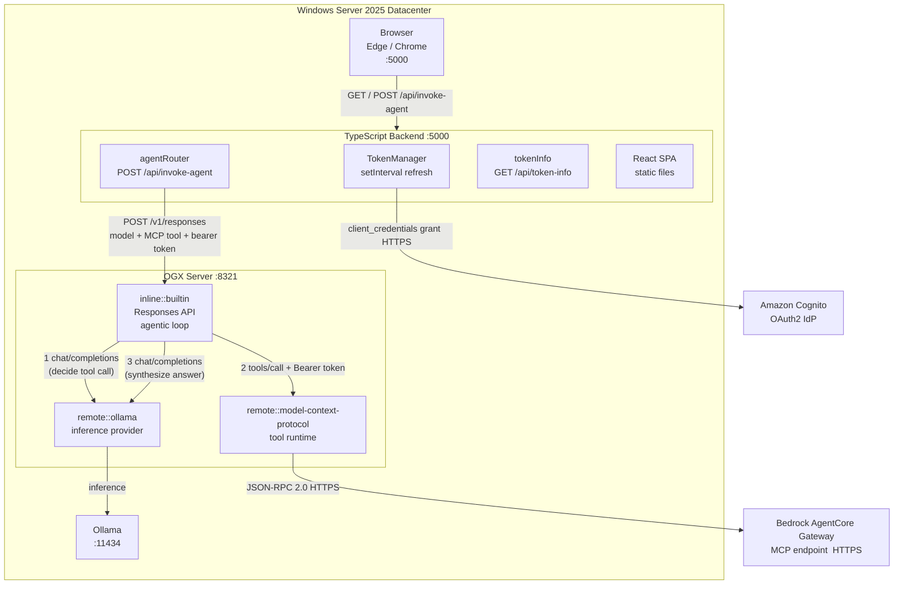
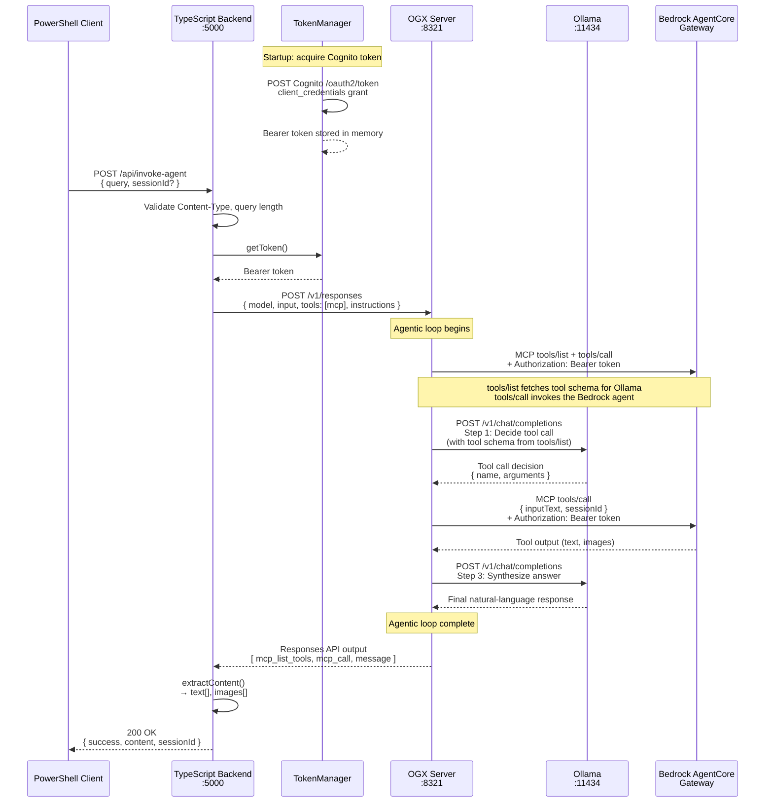

# Design Document: Bedrock AgentCore Web App

## Overview

This document describes the design for a browser-based chat web application that lets users send natural-language queries to an AWS Bedrock AgentCore Gateway. The system consists of three cooperating processes:

1. **OGX Server** (Python, existing, port 8321) — started with a custom `ogx-config.yaml` that wires `remote::ollama` (local inference), `remote::model-context-protocol` (tool runtime), and `inline::builtin` (Responses API agentic loop).
2. **TypeScript Backend Server** (Node.js/Express, port 5000) — manages Cognito OAuth2 token lifecycle, serves the React SPA, and exposes `POST /api/invoke-agent` which calls OGX's `POST /v1/responses` with the MCP tool entry.
3. **React Frontend** (TypeScript, Vite, port 3000 in dev / served from backend in prod) — chat SPA with conversation history, loading states, and inline image rendering.

### Key Design Decisions

- **OGX as the orchestration layer**: The TypeScript backend calls OGX's standard OpenAI-compatible Responses API (`POST /v1/responses`). OGX handles the full agentic loop: it calls Ollama for inference, discovers and invokes MCP tools on the AgentCore Gateway, and feeds results back. The TypeScript app never speaks directly to Ollama or the gateway.
- **Provider switching via OGX config only**: To switch from Bedrock AgentCore to a local Ollama RAG server, only `ogx-config.yaml` and the `BEDROCK_AGENT_CORE_GATEWAY_URL` env var change. The TypeScript application code is unchanged.
- **MCP authorization via the `authorization` field**: OGX's `remote::model-context-protocol` provider accepts an `authorization` field on the MCP tool entry in the Responses API `tools` array. The TypeScript backend passes the Cognito bearer token there; OGX forwards it as `Authorization: Bearer <token>` on every MCP call to the gateway.
- **Token lifecycle in the TypeScript backend**: The `TokenManager` module runs a proactive refresh loop using `setInterval`. No external token cache is needed for a single-host deployment.
- **dotenv for configuration**: All secrets and URLs come from a `.env` file loaded at startup via the `dotenv` package. No secrets are baked into source code or distribution configs.
- **PowerShell startup script**: A `.ps1` script starts all three processes in the correct order on Windows Server 2025 without requiring WSL or containers.

---

## Architecture



### Why Ollama is Required

The AgentCore Gateway is an **MCP tool server** — it returns raw tool output (text, images) in response to a `tools/call` JSON-RPC request. It does not produce a final user-facing answer on its own.

OGX's Responses API runs a **three-step agentic loop** for every request:

1. **Decide** — Ollama receives the user query and the list of available MCP tools. It decides which tool to call and with what arguments.
2. **Execute** — OGX's `remote::model-context-protocol` provider calls the AgentCore Gateway with the bearer token and returns the raw tool output.
3. **Synthesize** — Ollama receives the tool output and produces the final natural-language answer shown to the user.

Without a local model, OGX has no way to perform steps 1 and 3. This is also why the design works cleanly for the **Ollama local RAG** experiment: a local RAG MCP server returns document chunks, and Ollama synthesizes the answer from those chunks — the same three-step loop, different MCP server.

### OGX Responses API Call Shape

The TypeScript backend constructs this payload and sends it to OGX:

```typescript
POST http://localhost:8321/v1/responses
{
  "model": process.env.OLLAMA_MODEL ?? "ollama/llama3.2",
  "input": [{ "role": "user", "content": query }],
  "tools": [{
    "type": "mcp",
    "server_url": process.env.BEDROCK_AGENT_CORE_GATEWAY_URL,
    "server_label": "bedrock-agentcore",
    "authorization": bearerToken   // Cognito OAuth2 token
  }]
}
```

OGX's `inline::builtin` responses provider runs the agentic loop: it calls Ollama for inference, discovers MCP tools from the gateway, invokes them with the bearer token, and feeds results back to Ollama until a final answer is produced.

### Backend Request Sequence

Sequence diagram showing the full request flow when a user sends a query through the backend to the Bedrock AgentCore Gateway.



### Process Startup Order

1. Ollama must already be running (installed as a Windows service or started manually).
2. OGX Server starts: `uv run ogx stack run --config webapp/ogx-config.yaml`
3. React client is built: `npm run build` in `webapp/client/`
4. TypeScript backend starts: `npm start` in `webapp/server/`
5. The PowerShell startup script (`Start-WebApp.ps1`) orchestrates steps 2–4.

### Provider Switching

To switch from Bedrock AgentCore to a local Ollama RAG MCP server:

1. Update `BEDROCK_AGENT_CORE_GATEWAY_URL` in `.env` to point to the local MCP-compatible RAG server.
2. Set `COGNITO_TOKEN_URL`, `COGNITO_CLIENT_ID`, `COGNITO_CLIENT_SECRET` to empty strings (no auth needed for local).
3. Restart the TypeScript backend.

No TypeScript application code changes. Alternatively, maintain a second `ogx-config-local-rag.yaml` for the Ollama RAG scenario and pass it to `ogx stack run`.

---

## Components and Interfaces

### A. OGX Server (`webapp/ogx-config.yaml`)

A minimal OGX distribution config that enables only the APIs needed for this application:

```yaml
version: 2
distro_name: bedrock-agentcore-webapp
apis:
  - inference
  - tool_runtime
  - responses
providers:
  inference:
    - provider_id: ollama
      provider_type: remote::ollama
      config:
        base_url: ${env.OLLAMA_URL:=http://localhost:11434/v1}
  tool_runtime:
    - provider_id: model-context-protocol
      provider_type: remote::model-context-protocol
  responses:
    - provider_id: builtin
      provider_type: inline::builtin
      config:
        persistence:
          agent_state:
            namespace: agents
            backend: kv_default
          responses:
            table_name: responses
            backend: sql_default
storage:
  backends:
    kv_default:
      type: kv_sqlite
      db_path: ${env.SQLITE_STORE_DIR:=~/.ogx/bedrock-agentcore-webapp}/kvstore.db
    sql_default:
      type: sql_sqlite
      db_path: ${env.SQLITE_STORE_DIR:=~/.ogx/bedrock-agentcore-webapp}/sql_store.db
  stores:
    metadata:
      namespace: registry
      backend: kv_default
    inference:
      table_name: inference_store
      backend: sql_default
server:
  port: 8321
```

### B. TypeScript Backend Server (`webapp/server/`)

A Node.js/Express application with four responsibilities: config validation, token lifecycle, API routing, and static file serving.

#### Project Structure

```
webapp/server/
  src/
    index.ts          # Entry point: load config, init TokenManager, start Express
    config.ts         # Env var loading (dotenv) and validation
    tokenManager.ts   # Cognito OAuth2 lifecycle (acquire, refresh, proactive loop)
    agentRouter.ts    # POST /api/invoke-agent handler
    tokenInfo.ts      # GET /api/token-info handler
  package.json
  tsconfig.json
```

#### HTTP Endpoints

| Method | Path | Description |
|--------|------|-------------|
| `GET` | `/` | Serve React SPA (`client/dist/index.html`) |
| `GET` | `/assets/*` | Serve React SPA static assets |
| `POST` | `/api/invoke-agent` | Invoke agent via OGX Responses API |
| `GET` | `/api/token-info` | Return non-sensitive token metadata |

#### `POST /api/invoke-agent`

Request body (`application/json`):
```json
{
  "query": "string (1–10000 chars, required)",
  "sessionId": "string (optional, UUID)"
}
```

Response body on success (`200 OK`):
```json
{
  "success": true,
  "content": {
    "text": ["string", "..."],
    "images": [{ "alt": "string", "url": "string" }]
  },
  "sessionId": "string"
}
```

Response body on error:
```json
{
  "success": false,
  "error": "Failed to invoke agent: <reason>"
}
```

HTTP status codes:
- `200` — successful OGX/gateway response
- `400` — missing/invalid `query` field or query exceeds 10,000 characters
- `415` — `Content-Type` is not `application/json`
- `502` — OGX or gateway returned 4xx/5xx
- `503` — OAuth2 token unavailable
- `504` — OGX/gateway timeout (30 s)

#### `GET /api/token-info`

Response body (`200 OK`):
```json
{
  "expiresAt": "ISO-8601 timestamp",
  "remainingSeconds": 1234,
  "scopes": ["string"]
}
```

Never includes the token value itself.

### C. React Frontend (`webapp/client/`)

A Vite + React + TypeScript SPA.

#### Project Structure

```
webapp/client/
  src/
    App.tsx
    components/
      ChatWindow.tsx    # Scrollable conversation history
      MessageBubble.tsx # Single message (user or assistant)
      InputBar.tsx      # Text input + submit button
    hooks/
      useSession.ts     # sessionId persistence in sessionStorage
      useChat.ts        # API call logic, loading state
    types.ts            # Shared TypeScript types
  index.html
  package.json
  vite.config.ts
```

#### Key Behaviors

- `sessionId` persisted in `sessionStorage` (cleared when tab closes).
- `POST /api/invoke-agent` sent with `Content-Type: application/json`.
- User messages right-aligned, assistant messages left-aligned.
- Loading spinner + disabled submit button while request is in flight.
- Inline image rendering from `content.images` array.
- Keyboard accessible: Tab navigation, Enter to submit.
- In development, Vite dev server (port 3000) proxies `/api/*` to `localhost:5000`.
- In production, the React build is served as static files by the Express backend.

---

## Data Models

### Configuration (TypeScript, `config.ts`)

```typescript
interface AppConfig {
  gatewayUrl: string;           // BEDROCK_AGENT_CORE_GATEWAY_URL (required)
  cognitoTokenUrl: string;      // COGNITO_TOKEN_URL (required)
  cognitoClientId: string;      // COGNITO_CLIENT_ID (required)
  cognitoClientSecret: string;  // COGNITO_CLIENT_SECRET (required, never serialized)
  ollamaUrl: string;            // OLLAMA_URL (default: http://localhost:11434/v1)
  ollamaModel: string;          // OLLAMA_MODEL (default: ollama/llama3.2)
  ogxBaseUrl: string;           // OGX_BASE_URL (default: http://localhost:8321)
  port: number;                 // PORT (default: 5000)
}
```

Required env vars (startup exits with code 1 if any are absent or empty):
- `BEDROCK_AGENT_CORE_GATEWAY_URL`
- `COGNITO_TOKEN_URL`
- `COGNITO_CLIENT_ID`
- `COGNITO_CLIENT_SECRET`

Optional env vars with defaults:

| Variable | Default |
|----------|---------|
| `OLLAMA_URL` | `http://localhost:11434/v1` |
| `OLLAMA_MODEL` | `ollama/llama3.2` |
| `OGX_BASE_URL` | `http://localhost:8321` |
| `PORT` | `5000` |

### Internal Token State (`tokenManager.ts`)

```typescript
interface TokenState {
  accessToken: string;    // in-memory only, never serialized
  expiresAt: Date;
  scopes: string[];
  isValid: boolean;
}
```

### API Request/Response Types (`types.ts`)

```typescript
interface InvokeAgentRequest {
  query: string;        // 1–10,000 chars
  sessionId?: string;   // UUID, optional
}

interface ImageBlock {
  alt: string;
  url: string;
}

interface ContentBlock {
  text: string[];
  images: ImageBlock[];
}

interface InvokeAgentResponse {
  success: boolean;
  content?: ContentBlock;
  sessionId?: string;
  error?: string;
}

interface TokenInfoResponse {
  expiresAt: string;        // ISO-8601
  remainingSeconds: number;
  scopes: string[];
  // accessToken is intentionally absent
}
```

### OGX Responses API Payload

Request sent from TypeScript backend to OGX:
```typescript
interface OgxResponsesRequest {
  model: string;                          // e.g. "ollama/llama3.2"
  input: Array<{ role: string; content: string }>;
  tools: Array<OgxMcpTool>;
}

interface OgxMcpTool {
  type: "mcp";
  server_url: string;                     // BEDROCK_AGENT_CORE_GATEWAY_URL
  server_label: string;                   // "bedrock-agentcore"
  authorization: string;                  // "Bearer <cognito_token>"
}
```

OGX response shape (used for content extraction):
```typescript
interface OgxResponsesOutput {
  output: Array<{
    type: string;
    content?: Array<{
      type: "text" | "image_url";
      text?: string;
      image_url?: { url: string; detail?: string };
    }>;
  }>;
}
```

---

## Correctness Properties

*A property is a characteristic or behavior that should hold true across all valid executions of a system — essentially, a formal statement about what the system should do. Properties serve as the bridge between human-readable specifications and machine-verifiable correctness guarantees.*

### Property 1: Required config variables cause startup failure

*For any* combination of the four required environment variables (`BEDROCK_AGENT_CORE_GATEWAY_URL`, `COGNITO_TOKEN_URL`, `COGNITO_CLIENT_ID`, `COGNITO_CLIENT_SECRET`) where at least one is absent or empty, the `validateConfig` function SHALL throw an error whose message is prefixed with `"Failed to start:"`.

**Validates: Requirements 1.2, 7.6**

---

### Property 2: Client secret and bearer token are never serialized or returned in responses

*For any* `AppConfig` instance with any arbitrary `COGNITO_CLIENT_SECRET` value, and for any `TokenState` with any arbitrary `accessToken` value, no HTTP response body from any endpoint SHALL contain the secret value or the token value.

**Validates: Requirements 2.6, 7.1**

---

### Property 3: Client secret and bearer token never appear in log output

*For any* secret string and bearer token value, capturing all log records emitted during startup and request handling SHALL NOT contain the secret string or the bearer token value in any log record's message or structured fields.

**Validates: Requirements 1.3, 7.2**

---

### Property 4: Token-info endpoint never exposes the token value

*For any* `TokenState` with any arbitrary `accessToken` value, the `TokenInfoResponse` object derived from it SHALL contain `expiresAt`, `remainingSeconds`, and `scopes`, and SHALL NOT contain the `accessToken` value in any field.

**Validates: Requirements 2.7**

---

### Property 5: Token refresh is scheduled at or before 80% of expires_in

*For any* `expires_in` duration in seconds, the proactive refresh delay computed by `TokenManager` SHALL be less than or equal to `Math.floor(expiresIn * 0.8)` seconds from the token's issue time, ensuring the token is replaced before it expires.

**Validates: Requirements 2.3**

---

### Property 6: Invalid token causes HTTP 503 on every invoke-agent request

*For any* `POST /api/invoke-agent` request arriving when `TokenState.isValid` is `false`, the server SHALL return HTTP 503 with a response body where `success` is `false` and `error` equals `"Failed to process request: OAuth2 token unavailable"`.

**Validates: Requirements 2.5**

---

### Property 7: OGX Responses API call always includes MCP tool with correct server_url and authorization

*For any* query string and any bearer token value, the OGX Responses API payload constructed by `agentRouter` SHALL have `tools[0].type === "mcp"`, `tools[0].server_url` equal to the configured `BEDROCK_AGENT_CORE_GATEWAY_URL`, and `tools[0].authorization` equal to the current bearer token string.

**Validates: Requirements 3.1, 3.2**

---

### Property 8: Session ID round-trip

*For any* `POST /api/invoke-agent` request that includes a `sessionId`, the `sessionId` in the successful response SHALL equal the `sessionId` from the request. *For any* request that omits `sessionId`, the successful response SHALL contain a non-empty `sessionId` that is a valid UUID v4.

**Validates: Requirements 3.3, 3.4**

---

### Property 9: Successful response structure invariant

*For any* successful OGX Responses API response containing any combination of text and image content blocks, the HTTP response returned by `POST /api/invoke-agent` SHALL have `success === true`, a non-null `content` field, a non-empty `sessionId`, and each image block SHALL appear in `content.images` with both `alt` and `url` fields populated.

**Validates: Requirements 3.5, 3.6**

---

### Property 10: Gateway or OGX HTTP errors are mapped to HTTP 502

*For any* HTTP status code in the 4xx or 5xx range returned by OGX or the AgentCore Gateway, the server SHALL return HTTP 502 to the caller with a response body where `success` is `false` and `error` starts with `"Failed to invoke agent:"`.

**Validates: Requirements 3.7**

---

### Property 11: Query length validation rejects oversized inputs

*For any* `query` string whose length exceeds 10,000 characters, the server SHALL return HTTP 400 with a response body where `success` is `false` and `error` equals `"Failed to process request: query exceeds maximum length"`, and the request SHALL NOT be forwarded to OGX.

**Validates: Requirements 7.5**

---

### Property 12: Non-JSON Content-Type is rejected with HTTP 415

*For any* `POST /api/invoke-agent` request whose `Content-Type` header is not `application/json`, the server SHALL return HTTP 415 and SHALL NOT forward the request to OGX.

**Validates: Requirements 7.4**

---

## Error Handling

### Startup Errors

| Condition | Behavior |
|-----------|----------|
| Missing required env var | Log `"Failed to start: <VAR> is required"`, `process.exit(1)` |
| Cognito token acquisition fails after 3 retries | Log `"Failed to acquire initial OAuth2 token"`, `process.exit(1)` |
| Ollama unreachable at startup | Log `"Failed to connect to Ollama: <error>"` at WARN level, continue |

### Runtime Errors

| Condition | HTTP Status | Response Body |
|-----------|-------------|---------------|
| `Content-Type` not `application/json` | 415 | `{ "success": false, "error": "Failed to process request: unsupported content type" }` |
| `query` missing or empty | 400 | `{ "success": false, "error": "Failed to process request: query is required" }` |
| `query` > 10,000 chars | 400 | `{ "success": false, "error": "Failed to process request: query exceeds maximum length" }` |
| Token unavailable (`isValid === false`) | 503 | `{ "success": false, "error": "Failed to process request: OAuth2 token unavailable" }` |
| OGX or gateway 4xx/5xx | 502 | `{ "success": false, "error": "Failed to invoke agent: <error message>" }` |
| OGX or gateway timeout (30 s) | 504 | `{ "success": false, "error": "Failed to invoke agent: gateway timeout" }` |
| Unexpected server error | 500 | `{ "success": false, "error": "Failed to process request: internal server error" }` |

All error messages follow the convention of being prefixed with `"Failed to ..."`.

### Token Refresh Errors

When proactive refresh fails after 3 exponential back-off attempts (2 s, 4 s, 8 s):
1. Log `"Failed to refresh OAuth2 token"` at ERROR level (without the token value).
2. Set `tokenState.isValid = false`.
3. Subsequent `invoke-agent` calls return HTTP 503 until a background re-acquisition succeeds.
4. The background loop continues attempting re-acquisition with a 60 s interval.

---

## Testing Strategy

### Unit Tests

Unit tests cover pure logic that does not require a running server or external services. They use [Vitest](https://vitest.dev/) with `vi.mock` for dependency injection.

Key unit test areas:
- `config.ts` validation: missing required fields, defaults applied correctly, secret not included in any serialized output.
- `tokenManager.ts`: token expiry calculation, refresh scheduling at 80% of `expiresIn`, retry logic with mocked `fetch`, token-invalid state transitions.
- `agentRouter.ts`: OGX Responses API payload construction, bearer token field injection, response content extraction (text and image blocks), error mapping (4xx → 502, timeout → 504).
- Input validation: query length boundary (9,999 / 10,000 / 10,001 chars), missing `query` field, `sessionId` generation when absent.
- `tokenInfo.ts`: confirm `accessToken` is absent from output.

### Property-Based Tests

Property-based tests use [fast-check](https://fast-check.io/) and run a minimum of 100 iterations per property.

Each test is tagged with a comment in the format:
`// Feature: bedrock-agentcore-web-app, Property <N>: <property_text>`

| Property | Test Description | fast-check Arbitrary |
|----------|-----------------|----------------------|
| P1: Required config startup failure | Generate all non-empty subsets of the 4 required vars with at least one missing/empty | `fc.subarray([...vars]).filter(s => s.length < 4)` combined with `fc.boolean()` for empty vs. absent |
| P2: Secret/token not in responses | Generate arbitrary secret and token strings | `fc.string({ minLength: 1 })` for both |
| P3: Secret/token not in logs | Generate arbitrary secret and token strings | `fc.string({ minLength: 1 })` for both |
| P4: Token info never exposes token | Generate arbitrary `TokenState` instances | `fc.record({ accessToken: fc.string({ minLength: 1 }), ... })` |
| P5: Refresh scheduled at ≤80% | Generate arbitrary `expiresIn` values | `fc.integer({ min: 60, max: 86400 })` |
| P6: Invalid token → HTTP 503 | Set `isValid: false`, generate arbitrary requests | `fc.string({ minLength: 1, maxLength: 10000 })` for query |
| P7: OGX call has correct MCP tool | Generate arbitrary queries and token strings | `fc.string()` for both |
| P8: Session ID round-trip | Generate arbitrary UUID session IDs and queries | `fc.uuid()`, `fc.string({ minLength: 1, maxLength: 10000 })` |
| P9: Response structure invariant | Generate arbitrary OGX response payloads | `fc.array(fc.oneof(textBlockArb, imageBlockArb))` |
| P10: Gateway error → HTTP 502 | Generate arbitrary 4xx/5xx status codes | `fc.integer({ min: 400, max: 599 })` |
| P11: Query length → HTTP 400 | Generate strings > 10,000 chars | `fc.string({ minLength: 10001, maxLength: 20000 })` |
| P12: Non-JSON Content-Type → HTTP 415 | Generate arbitrary non-JSON content types | `fc.string().filter(s => s !== "application/json")` |

### Integration Tests

Integration tests verify the full request path with a running Express server and mocked external services (Cognito, OGX). They use Vitest with [supertest](https://github.com/ladjs/supertest) for HTTP assertions and `nock` or `msw` for HTTP mocking.

Key integration test scenarios:
- Full `POST /api/invoke-agent` round-trip with mocked Cognito token and mocked OGX response.
- Token refresh triggered mid-request (mock Cognito to return a new token).
- OGX timeout: mock OGX to delay > 30 s, verify HTTP 504.
- OGX 500: verify HTTP 502 with correct error body.
- `GET /api/token-info` returns correct metadata, no token value.
- React SPA served at `GET /`.

### Manual / Smoke Tests

- Start the full stack on Windows Server 2025 using `Start-WebApp.ps1`.
- Open `http://localhost:5000` in Edge and Chrome; verify the chat UI loads.
- Submit a query; verify the response appears in the conversation history.
- Verify keyboard navigation (Tab, Enter) works correctly.
- Verify `GET /api/token-info` returns expected JSON without the token value.
- Verify that stopping the script terminates all processes cleanly.
- Verify provider switching: update `BEDROCK_AGENT_CORE_GATEWAY_URL` to a local MCP server, restart backend, confirm queries route correctly without code changes.
