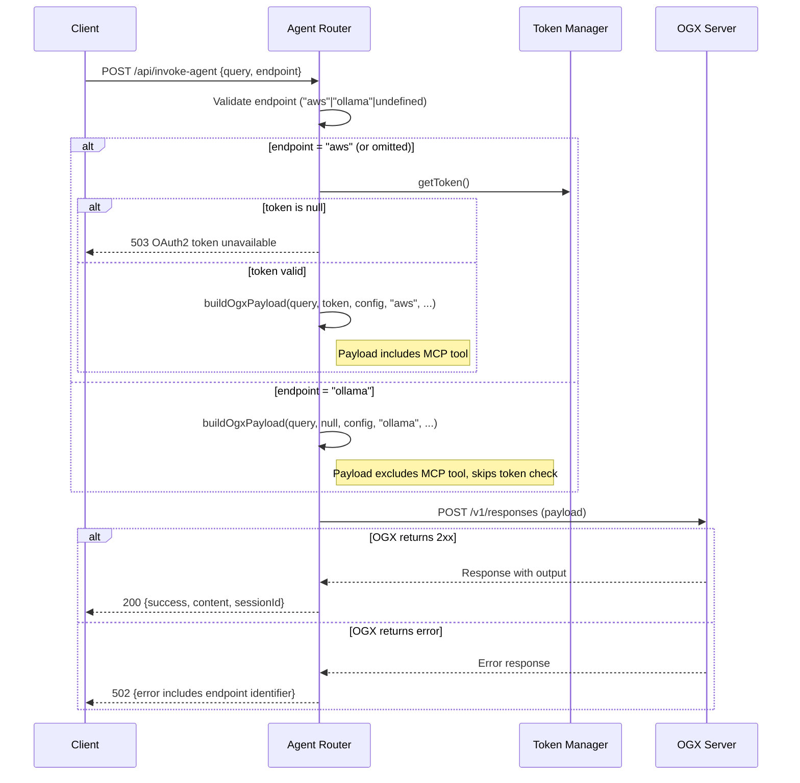
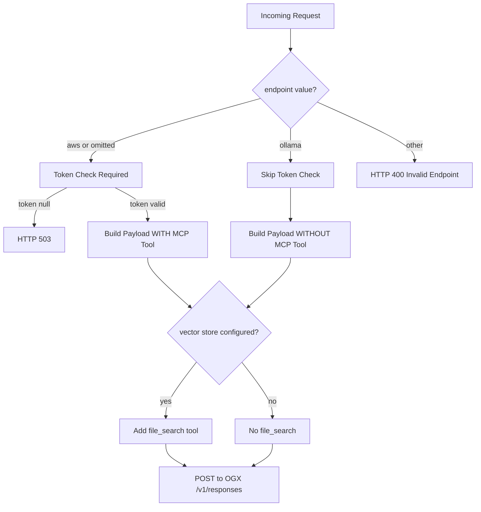

# Design Document: Endpoint Selection

## Overview

This feature adds an `endpoint` parameter to the `POST /api/invoke-agent` request body, allowing callers to explicitly choose between the AWS Bedrock AgentCore MCP gateway and the local Ollama inference server. The routing logic lives entirely in `agentRouter.ts` — the `buildOgxPayload` function is extended (or a sibling function introduced) to conditionally include or exclude the MCP tool based on the selected endpoint.

The design is minimal: no new files, no new routers. The existing `buildOgxPayload` gains an `endpoint` parameter that controls whether the MCP tool object is attached to the OGX Responses API payload.

## Architecture

### Request Flow



### Payload Differences by Endpoint



## Components and Interfaces

### Modified Interface: `InvokeAgentRequest`

The existing `InvokeAgentRequest` in `types.ts` gains an optional `endpoint` field:

```typescript
export type EndpointType = "aws" | "ollama";

export interface InvokeAgentRequest {
  query: string;            // 1–10,000 chars
  sessionId?: string;       // UUID, optional
  endpoint?: EndpointType;  // "aws" | "ollama", defaults to "aws"
}
```

### Modified Function: `buildOgxPayload`

The signature changes to accept an `endpoint` parameter. When `endpoint` is `"ollama"`, the MCP tool is omitted and `bearerToken` may be `null`:

```typescript
export function buildOgxPayload(
  query: string,
  bearerToken: string | null,
  config: AppConfig,
  endpoint: EndpointType,
  sessionId?: string,
  vectorStoreId?: string | null
): OgxResponsesRequest {
  const tools: Array<OgxMcpTool | OgxFileSearchTool> = [];

  if (endpoint === "aws") {
    tools.push({
      type: "mcp",
      server_url: config.gatewayUrl,
      server_label: "bedrock-agentcore",
      authorization: bearerToken!,  // guaranteed non-null by caller
    });
  }

  if (vectorStoreId != null && vectorStoreId !== "") {
    tools.push({ type: "file_search", vector_store_ids: [vectorStoreId] });
  }

  const payload: OgxResponsesRequest = {
    model: config.ollamaModel,
    input: [{ role: "user", content: query }],
    tools,
  };

  if (sessionId) {
    payload.instructions = `When calling the multimodal-agent___invoke_bedrock_agent tool, always use sessionId "${sessionId}". Do not invent or guess a sessionId.`;
  }

  return payload;
}
```

### Modified Router Logic in `createAgentRouter`

The route handler changes:

1. **Validation step** (after query validation, before token check): validate `endpoint` field.
2. **Conditional token check**: only require a valid token when `endpoint === "aws"`.
3. **Payload construction**: pass `endpoint` to `buildOgxPayload`.
4. **Error responses**: include endpoint identifier in error messages.

```typescript
// New validation step (inserted after query length check)
const endpoint: EndpointType = (() => {
  const raw = (req.body as { endpoint?: unknown }).endpoint;
  if (raw === undefined || raw === null || raw === "") return "aws";
  if (raw === "aws" || raw === "ollama") return raw;
  return null; // signals invalid
})() as EndpointType | null;

if (endpoint === null) {
  res.status(400).json({
    success: false,
    error: "Failed to process request: invalid endpoint value",
  });
  return;
}

// Conditional token check
let bearerToken: string | null = null;
if (endpoint === "aws") {
  bearerToken = tokenManager.getToken();
  if (bearerToken === null) {
    res.status(503).json({
      success: false,
      error: "Failed to process request: OAuth2 token unavailable",
    });
    return;
  }
}
```

### Error Response Format

Error messages include the endpoint identifier without exposing internal URLs or credentials:

```typescript
// OGX non-2xx response
res.status(502).json({
  success: false,
  error: `Failed to invoke agent [${endpoint}]: ${ogxResponse.statusText}`,
});
```

## Data Models

### Request Body Schema

| Field | Type | Required | Default | Constraints |
|-------|------|----------|---------|-------------|
| `query` | string | yes | — | 1–10,000 chars |
| `sessionId` | string | no | auto-generated UUID v4 | UUID format |
| `endpoint` | string | no | `"aws"` | `"aws"` or `"ollama"` |

### Type Addition in `types.ts`

```typescript
export type EndpointType = "aws" | "ollama";
```

The `InvokeAgentRequest` interface is updated to include the optional `endpoint` field. No new interfaces are needed — the existing `OgxResponsesRequest`, `OgxMcpTool`, and `OgxFileSearchTool` types remain unchanged.

### Payload Shape by Endpoint

**endpoint = "aws"** (with vector store):
```json
{
  "model": "ollama/llama3.2",
  "input": [{"role": "user", "content": "..."}],
  "tools": [
    {"type": "mcp", "server_url": "...", "server_label": "bedrock-agentcore", "authorization": "Bearer ..."},
    {"type": "file_search", "vector_store_ids": ["vs-123"]}
  ]
}
```

**endpoint = "ollama"** (with vector store):
```json
{
  "model": "ollama/llama3.2",
  "input": [{"role": "user", "content": "..."}],
  "tools": [
    {"type": "file_search", "vector_store_ids": ["vs-123"]}
  ]
}
```

**endpoint = "ollama"** (no vector store):
```json
{
  "model": "ollama/llama3.2",
  "input": [{"role": "user", "content": "..."}],
  "tools": []
}
```

## Correctness Properties

*A property is a characteristic or behavior that should hold true across all valid executions of a system — essentially, a formal statement about what the system should do. Properties serve as the bridge between human-readable specifications and machine-verifiable correctness guarantees.*

### Property 1: Invalid endpoint values are rejected

*For any* string that is not `"aws"` and not `"ollama"` (and is not empty/undefined), when used as the `endpoint` field in a request with a valid query, the Agent Router SHALL return HTTP 400 with `success: false` and an error message containing "invalid endpoint".

**Validates: Requirements 1.3**

### Property 2: AWS endpoint includes MCP tool with correct configuration

*For any* valid query and any gateway URL, when `endpoint` is `"aws"` and a valid token exists, the built OGX payload SHALL contain a tool with `type: "mcp"`, `server_url` equal to `config.gatewayUrl`, and `authorization` equal to the bearer token.

**Validates: Requirements 2.1, 1.4**

### Property 3: Ollama endpoint excludes MCP tool

*For any* valid query, when `endpoint` is `"ollama"`, the built OGX payload SHALL NOT contain any tool with `type: "mcp"`.

**Validates: Requirements 3.1**

### Property 4: Omitted endpoint defaults to AWS behavior

*For any* valid query where the `endpoint` field is omitted (undefined) or empty string, the resulting OGX payload SHALL be identical to a payload built with `endpoint: "aws"` (i.e., includes the MCP tool).

**Validates: Requirements 1.2**

### Property 5: Ollama endpoint skips token validation

*For any* valid query with `endpoint: "ollama"`, even when the Token Manager returns a null token, the request SHALL proceed to OGX (not return 503).

**Validates: Requirements 3.3**

### Property 6: Model field always matches config

*For any* endpoint value (`"aws"` or `"ollama"`) and any `ollamaModel` configuration value, the built OGX payload `model` field SHALL equal `config.ollamaModel`.

**Validates: Requirements 2.2, 3.2**

### Property 7: Vector store inclusion is endpoint-independent

*For any* endpoint value (`"aws"` or `"ollama"`) and any non-empty vector store ID, the built OGX payload SHALL contain a tool with `type: "file_search"` and `vector_store_ids` including that ID.

**Validates: Requirements 2.4, 3.4**

### Property 8: Error responses include endpoint identifier without exposing secrets

*For any* endpoint value and any OGX error (non-2xx status), the error response body SHALL contain the endpoint identifier string (`"aws"` or `"ollama"`) AND SHALL NOT contain the `config.gatewayUrl`, `config.cognitoTokenUrl`, or any bearer token value.

**Validates: Requirements 4.1, 4.2, 4.3, 4.4**

## Error Handling

| Scenario | HTTP Status | Error Message Pattern |
|----------|-------------|----------------------|
| Invalid `endpoint` value | 400 | `"Failed to process request: invalid endpoint value"` |
| `endpoint: "aws"`, token unavailable | 503 | `"Failed to process request: OAuth2 token unavailable"` |
| OGX returns non-2xx (any endpoint) | 502 | `"Failed to invoke agent [aws\|ollama]: <statusText>"` |
| OGX network error / unreachable | 502 | `"Failed to invoke agent [aws\|ollama]: endpoint unreachable"` |
| OGX timeout (AbortError) | 504 | `"Failed to invoke agent [aws\|ollama]: gateway timeout"` |
| Unexpected internal error | 500 | `"Failed to process request: internal server error"` |

### Design Decisions

1. **Error messages use bracket notation** (`[aws]`, `[ollama]`) to include the endpoint identifier in a parseable way without changing the existing error prefix pattern.
2. **Network errors map to 502** (Bad Gateway) rather than 503 (Service Unavailable) because the backend server itself is available — it's the upstream that failed.
3. **No credentials in errors**: The error handler never interpolates `config.gatewayUrl`, token values, or internal URLs into client-facing messages.

## Testing Strategy

### Property-Based Tests (fast-check)

The project already uses `fast-check` with `vitest` for property-based testing (see `agentRouter.property.test.ts`). New property tests will be added to a new file `webapp/server/src/__tests__/endpointSelection.property.test.ts`.

**Configuration:**
- Library: `fast-check` (already in devDependencies)
- Runner: `vitest run` (already configured)
- Minimum iterations: 100 per property
- Tag format: `Feature: endpoint-selection, Property {N}: {title}`

Each of the 8 correctness properties above maps to one property-based test. The tests use the same patterns as the existing `agentRouter.property.test.ts`:
- `makeConfig()` helper for AppConfig construction
- `makeTokenManager()` helper for mock token state
- `buildApp()` helper for Express app with mounted router
- `mockSuccessFetch()` / `mockErrorFetch()` for OGX response simulation

### Unit Tests (example-based)

Specific examples and edge cases not covered by property tests:
- Empty string endpoint defaults to "aws"
- `null` endpoint defaults to "aws"
- `undefined` endpoint defaults to "aws"
- Endpoint validation is case-sensitive (`"AWS"` → 400)
- Integration with existing query validation (invalid query + invalid endpoint → first validation wins)

### Test Organization

```
webapp/server/src/__tests__/
  endpointSelection.property.test.ts   ← 8 property-based tests (new)
  agentRouter.property.test.ts         ← existing tests (may need minor updates for new signature)
```

### Backward Compatibility

The existing `agentRouter.property.test.ts` tests call `buildOgxPayload` without the `endpoint` parameter. The function signature change adds `endpoint` as a required parameter (inserted before `sessionId`), so existing test calls will need updating. This is acceptable since it's an internal API, not a public contract.
