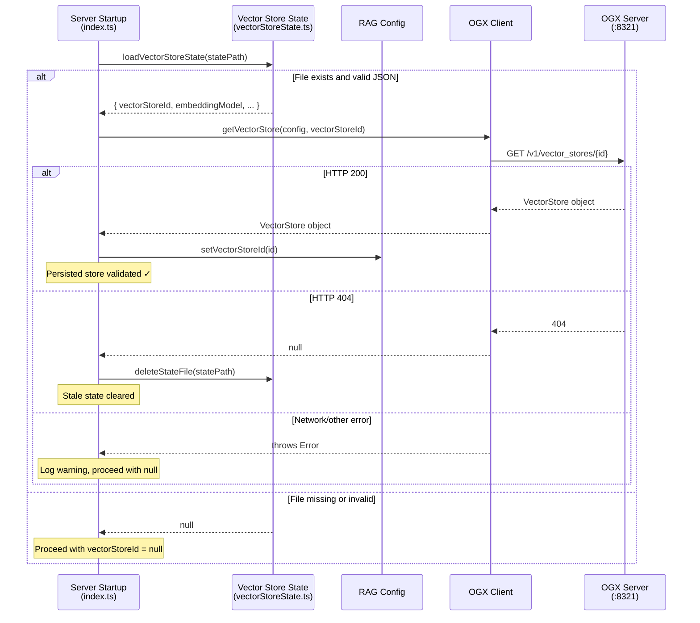
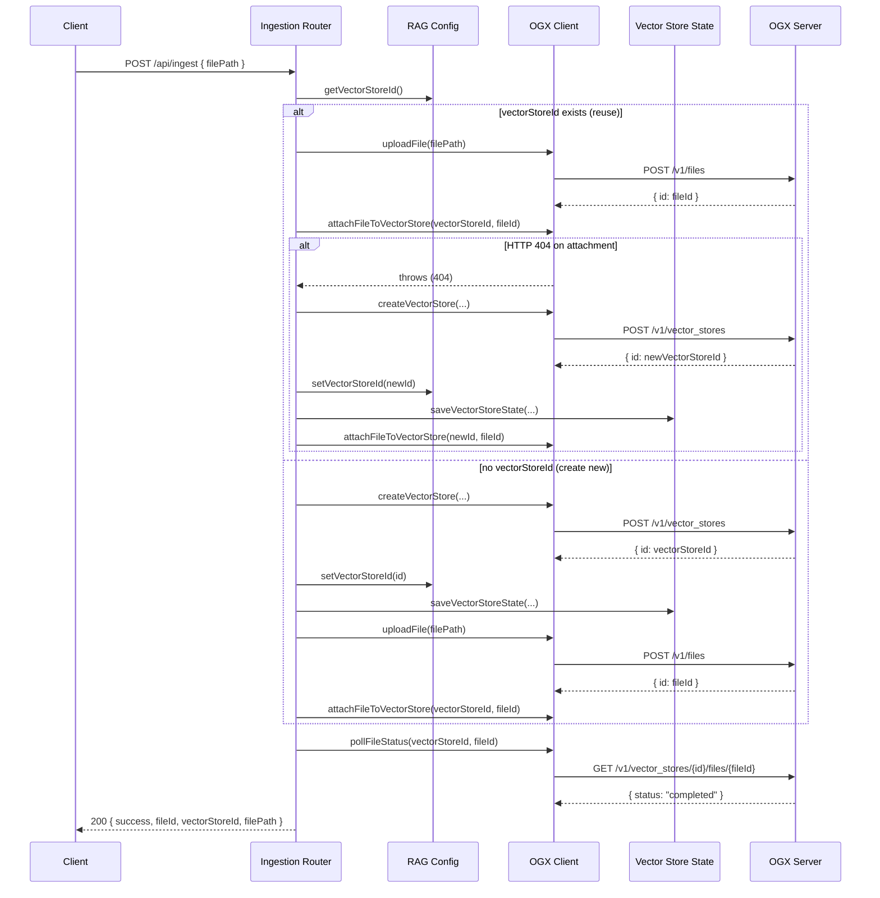

# Design Document: Persistent Vector Store State

## Overview

This design adds persistence of the vector store ID so the backend can reconnect to an existing OGX vector store on startup, reuse it across ingestion calls, and survive restarts without re-ingesting documents.

Currently, `RagConfig.vectorStoreId` is held only in memory. When the Node.js backend restarts, the ID is lost — even though the underlying OGX/sqlite-vec storage retains the data on disk. This feature introduces:

1. **Persistence Module** (`vectorStoreState.ts`) — reads/writes a JSON state file with atomic writes (write-to-temp then rename)
2. **Startup Validation** — loads the persisted state on startup and validates the vector store still exists in OGX via a new `getVectorStore` function
3. **Ingestion Reuse** — modifies the ingestion router to reuse an existing vector store instead of always creating a new one
4. **Backward Compatibility** — all persistence operations are skipped when `RAG_SOURCE=aws`

### Key Design Decisions

- **Atomic writes via temp-file + rename**: Prevents corruption from partial writes or crashes mid-write. Uses `fs.writeFile` to a `.tmp` sibling file, then `fs.rename` to the target path.
- **Graceful degradation**: All persistence failures (read or write) are logged but never crash the server. The system falls back to in-memory-only behavior.
- **Validation on startup only**: The persisted vector store is validated once at startup via `GET /v1/vector_stores/{id}`. If it returns 404, the stale state file is deleted. Network errors leave the file intact for retry on next restart.
- **Single retry on 404 during attachment**: If a reused vector store returns 404 during file attachment, the ingestion router creates a new store and retries once.
- **No new mandatory env vars**: `VECTOR_STORE_STATE_PATH` is optional with a sensible default.
- **Injectable dependencies**: The persistence module accepts optional `fs` functions and the OGX client accepts optional `fetchFn` for testability, following existing patterns.

## Architecture





## Components and Interfaces

### 1. Vector Store State Module (`webapp/server/src/vectorStoreState.ts`)

A new module responsible for reading and writing the persistence file. Pure I/O operations with injectable filesystem functions for testability.

```typescript
export interface VectorStoreStateData {
  version: number;           // always 1
  vectorStoreId: string;     // the OGX vector store ID
  embeddingModel: string;    // embedding model used when the store was created
  createdAt: string;         // ISO 8601 timestamp
}

export interface PersistenceConfig {
  statePath: string;         // resolved from VECTOR_STORE_STATE_PATH or default
}

/**
 * Creates a PersistenceConfig from environment variables.
 * Default path: webapp/server/.vector-store-state.json (relative to server root)
 */
export function createPersistenceConfig(
  env?: Record<string, string | undefined>
): PersistenceConfig;

/**
 * Loads the vector store state from disk.
 * Returns null if the file doesn't exist, is invalid JSON, or is missing vectorStoreId.
 * Never throws — logs warnings and returns null on any error.
 */
export async function loadVectorStoreState(
  statePath: string
): Promise<VectorStoreStateData | null>;

/**
 * Saves the vector store state to disk atomically.
 * Writes to a .tmp file first, then renames to the target path.
 * Never throws — logs errors and returns silently on failure.
 */
export async function saveVectorStoreState(
  statePath: string,
  data: VectorStoreStateData
): Promise<void>;

/**
 * Deletes the state file (used when a persisted store is found to be stale).
 * Never throws — logs errors and returns silently on failure.
 */
export async function deleteStateFile(
  statePath: string
): Promise<void>;

```

**Design rationale**: Separating persistence into its own module keeps `ragConfig.ts` pure (no I/O) and makes the atomic-write logic independently testable. The "never throws" contract ensures persistence failures cannot crash the server.

### 2. OGX Client Addition (`webapp/server/src/ogxClient.ts`)

A new `getVectorStore` function is added to the existing OGX Client module.

```typescript
export interface VectorStoreObject {
  id: string;
  name: string;
  status: string;
  // Additional fields from OGX response (not exhaustively typed)
  [key: string]: unknown;
}

/**
 * Retrieves a vector store by ID from OGX.
 * Returns the vector store object on HTTP 200.
 * Returns null on HTTP 404 (store does not exist).
 * Throws on any other non-2xx status with "Failed to retrieve vector store" prefix.
 */
export async function getVectorStore(
  config: OgxClientConfig,
  vectorStoreId: string
): Promise<VectorStoreObject | null>;
```

**Error handling**:
- HTTP 200 → return parsed JSON body as `VectorStoreObject`
- HTTP 404 → return `null`
- Any other non-2xx → throw `Error("Failed to retrieve vector store: HTTP {status}")`

### 3. Modified Ingestion Router (`webapp/server/src/ingestRouter.ts`)

The `createIngestRouter` factory gains a `persistenceConfig` parameter. The route handler is modified to:

1. **Reuse existing vector store**: If `ragConfig.vectorStoreId` is non-null, skip `createVectorStore` and use the existing ID directly for file upload and attachment.
2. **Persist after creation**: After creating a new vector store, call `saveVectorStoreState` with the new ID, embedding model, and current timestamp.
3. **Retry on 404**: If `attachFileToVectorStore` throws with a message containing "404" when reusing a store, create a new store, persist it, and retry attachment once.

```typescript
import type { PersistenceConfig } from './vectorStoreState.js';

export function createIngestRouter(
  appConfig: AppConfig,
  ragConfig: RagConfig,
  persistenceConfig?: PersistenceConfig,  // NEW — optional for backward compat
  fetchFn?: typeof fetch
): Router;
```

### 4. Modified Entry Point (`webapp/server/src/index.ts`)

The `main()` function is updated with a new startup phase between config loading and Express app creation:

```typescript
// After createRagConfig() and before Express app setup:
if (useOllamaRag) {
  const persistenceConfig = createPersistenceConfig();

  // 1. Load persisted state
  const state = await loadVectorStoreState(persistenceConfig.statePath);

  if (state) {
    // 2. Validate the persisted vector store still exists in OGX
    try {
      const store = await getVectorStore(ogxConfig, state.vectorStoreId);
      if (store) {
        setVectorStoreId(ragConfig, state.vectorStoreId);
        console.info(`Restored persisted vector store: ${state.vectorStoreId}`);
      } else {
        // 404 — store no longer exists
        await deleteStateFile(persistenceConfig.statePath);
        console.warn(`Persisted vector store no longer exists: ${state.vectorStoreId}`);
      }
    } catch (err) {
      // Network or other error — proceed without the persisted store
      console.warn(`Failed to validate persisted vector store: ${(err as Error).message}`);
    }
  }

  // Pass persistenceConfig to ingest router
  app.use('/api/ingest', createIngestRouter(config, ragConfig, persistenceConfig));
}
```

### 5. Gitignore Update

Add the following line to the root `.gitignore`:

```
# Vector store persistence state (local dev only)
.vector-store-state.json
```

## Data Models

### Persistence File Format

**Path**: Configurable via `VECTOR_STORE_STATE_PATH` env var. Default: `webapp/server/.vector-store-state.json`

**Schema** (version 1):
```json
{
  "version": 1,
  "vectorStoreId": "vs_abc123def456",
  "embeddingModel": "ollama/mxbai-embed-large",
  "createdAt": "2025-01-15T10:30:00.000Z"
}
```

| Field | Type | Description |
|---|---|---|
| `version` | `number` | Schema version, always `1` for now |
| `vectorStoreId` | `string` | The OGX vector store ID |
| `embeddingModel` | `string` | Embedding model used when the store was created |
| `createdAt` | `string` | ISO 8601 timestamp of when the store was first created |

**Reading tolerance**: The load function accepts any JSON object containing a non-empty string `vectorStoreId` field. Extra fields are ignored. Missing `version`, `embeddingModel`, or `createdAt` fields do not cause a read failure — only `vectorStoreId` is required.

### OGX API — GET Vector Store

**Request**: `GET /v1/vector_stores/{vectorStoreId}`

**Response (200)**:
```json
{
  "id": "vs_abc123def456",
  "name": "rag-documents",
  "status": "completed",
  "file_counts": { "in_progress": 0, "completed": 3, "failed": 0 },
  "embedding_model": "ollama/mxbai-embed-large",
  "embedding_dimension": 1024
}
```

**Response (404)**:
```json
{
  "detail": "Vector store not found"
}
```

## Correctness Properties

*A property is a characteristic or behavior that should hold true across all valid executions of a system — essentially, a formal statement about what the system should do. Properties serve as the bridge between human-readable specifications and machine-verifiable correctness guarantees.*

### Property 1: Persistence round-trip

*For any* valid vector store ID string (non-empty, no control characters) and any valid embedding model string, saving a `VectorStoreStateData` object via `saveVectorStoreState` and then loading it via `loadVectorStoreState` SHALL produce an object where `vectorStoreId` equals the original ID, `embeddingModel` equals the original model, `version` equals `1`, and `createdAt` is a valid ISO 8601 string.

**Validates: Requirements 1.1, 2.1, 5.1, 5.2**

### Property 2: Configurable state file path

*For any* non-empty string value assigned to the `VECTOR_STORE_STATE_PATH` environment variable, `createPersistenceConfig` SHALL produce a config whose `statePath` equals that string. When the variable is absent, the `statePath` SHALL equal the default path `webapp/server/.vector-store-state.json`.

**Validates: Requirements 1.2, 8.2**

### Property 3: Write errors are non-fatal

*For any* filesystem error thrown during the atomic write operation (writeFile or rename), `saveVectorStoreState` SHALL NOT propagate the error (i.e., the returned promise resolves without rejection).

**Validates: Requirements 1.3**

### Property 4: Load tolerates malformed input

*For any* string that is either not valid JSON, or is valid JSON but does not contain a non-empty string `vectorStoreId` field, `loadVectorStoreState` SHALL return `null` without throwing.

**Validates: Requirements 2.4, 5.3**

### Property 5: Load tolerates extra fields

*For any* JSON object that contains a valid non-empty string `vectorStoreId` field plus any number of additional arbitrary fields, `loadVectorStoreState` SHALL successfully return a state object with the correct `vectorStoreId`.

**Validates: Requirements 5.3**

### Property 6: getVectorStore returns store object on HTTP 200

*For any* non-empty vector store ID string, when the OGX server responds with HTTP 200 and a JSON body containing an `id` field, `getVectorStore` SHALL return an object whose `id` field matches the response body.

**Validates: Requirements 3.1, 7.1**

### Property 7: getVectorStore returns null on HTTP 404

*For any* non-empty vector store ID string, when the OGX server responds with HTTP 404, `getVectorStore` SHALL return `null`.

**Validates: Requirements 3.3, 7.2**

### Property 8: getVectorStore throws on non-2xx non-404 status

*For any* HTTP status code in the range 400–599 excluding 404, when the OGX server responds with that status, `getVectorStore` SHALL throw an Error whose message starts with "Failed to retrieve vector store".

**Validates: Requirements 3.4, 7.3**

### Property 9: Ingestion reuses existing vector store

*For any* valid file path and any non-null vector store ID already set in RAG_Config, calling the ingestion endpoint SHALL NOT invoke `createVectorStore` and SHALL use the existing vector store ID for file attachment.

**Validates: Requirements 4.1**

### Property 10: AWS RAG source skips persistence

*For any* ingestion operation performed while `RAG_SOURCE` is set to `aws`, the system SHALL NOT read from, write to, or delete the persistence file.

**Validates: Requirements 8.3**

## Error Handling

### Error Response Format

All error responses follow the existing convention:
```json
{ "success": false, "error": "Failed to <operation>: <detail>" }
```

### Persistence Error Handling (Non-HTTP)

| Condition | Behavior |
|---|---|
| State file doesn't exist on load | Return `null`, log info message |
| State file contains invalid JSON | Return `null`, log warning |
| State file missing `vectorStoreId` | Return `null`, log warning |
| Atomic write fails (writeFile) | Log error, continue without persisting |
| Atomic rename fails | Log error, attempt cleanup of temp file |
| State file delete fails | Log error, continue |

### HTTP Error Handling

| Condition | HTTP Status | Error Prefix |
|---|---|---|
| OGX GET vector store returns non-2xx/non-404 at startup | N/A (startup) | Log warning, proceed with null |
| OGX attachment returns 404 on reused store | Retry once | Create new store, retry attachment |
| OGX attachment retry also fails | 502 | `Failed to attach file to vector store` |
| All other OGX errors during ingestion | 502 | `Failed to ...` (existing behavior) |

### Startup Validation Flow

The startup validation is best-effort and never prevents the server from starting:

1. Load state file → failure = proceed with null
2. Validate via GET → 200 = use ID, 404 = delete file + null, error = null (keep file)
3. Server starts regardless of validation outcome

## Testing Strategy

### Property-Based Tests (fast-check, minimum 100 iterations each)

Property-based testing is appropriate for this feature because:
- The persistence module has pure read/write logic with clear input/output behavior
- The `getVectorStore` function has well-defined behavior that varies with HTTP status codes
- The ingestion reuse logic has a clear conditional that should hold for all valid vector store IDs
- The configuration module is a pure function with environment-driven behavior

**Library**: `fast-check` (already a dev dependency)
**Runner**: `vitest` (already configured)
**Minimum iterations**: 100 per property

Each property test is tagged with:
```
Feature: persistent-vector-db, Property {number}: {property_text}
```

**Test files**:
- `webapp/server/src/__tests__/vectorStoreState.property.test.ts` — Properties 1, 2, 3, 4, 5
- `webapp/server/src/__tests__/ogxClient.getVectorStore.property.test.ts` — Properties 6, 7, 8
- `webapp/server/src/__tests__/ingestRouter.reuse.property.test.ts` — Property 9

### Unit Tests (example-based)

Example-based tests for specific scenarios not covered by properties:

- **Atomic write mechanics** (Req 1.4): Mock `fs.writeFile` and `fs.rename`, verify temp file is written first then renamed
- **Startup validation — 200 retains ID** (Req 3.2): Mock `getVectorStore` returning an object, verify `ragConfig.vectorStoreId` is set
- **Startup validation — 404 deletes file** (Req 3.3): Mock `getVectorStore` returning null, verify `deleteStateFile` is called
- **Startup validation — network error keeps file** (Req 3.4): Mock `getVectorStore` throwing, verify file is NOT deleted
- **Ingestion retry on 404** (Req 4.3): Mock attachment failing with 404, verify new store is created and attachment retried
- **No persistence when RAG_SOURCE=aws** (Req 8.3): Verify ingest router is not mounted and no file operations occur
- **Backward compatibility — no state file** (Req 8.1): Verify first ingestion creates a new store (same as current behavior)

### Integration Tests

Manual integration testing against a running OGX server with Ollama:
1. Ingest a document, verify `.vector-store-state.json` is created with correct format
2. Restart the backend, verify startup log shows "Restored persisted vector store"
3. Ingest another document, verify it's added to the same vector store (no new store created)
4. Delete the OGX sqlite-vec database, restart, verify startup log shows stale store warning and state file is deleted
5. Query via `/api/invoke-agent` after restart to confirm RAG still works with restored store
