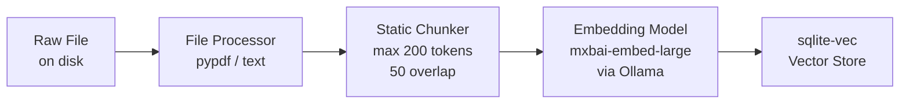
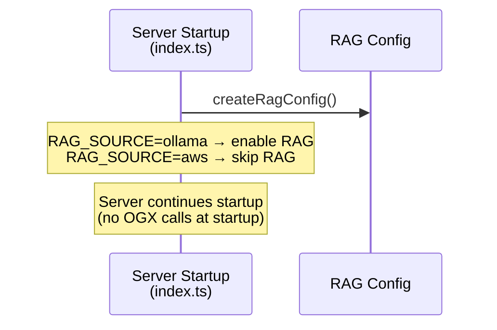
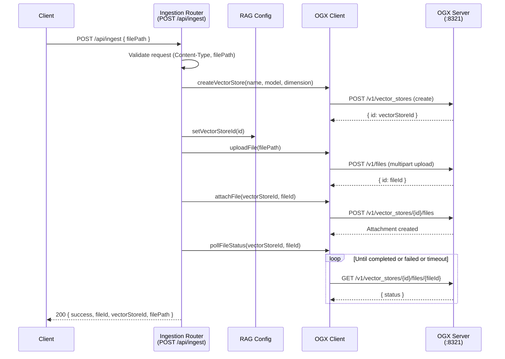
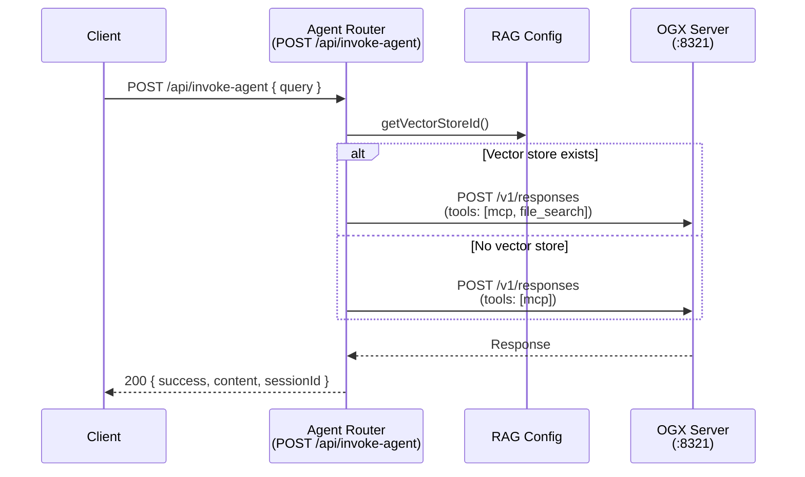

# Design Document: RAG Document Ingestion

## Overview

This design adds a RAG document ingestion pipeline to the Node.js/Express backend (`webapp/server/`). The pipeline orchestrates multi-step interactions with the OGX server to register an embedding model, create a vector store, upload files, and attach them for chunking and embedding. Once documents are ingested, the existing `/api/invoke-agent` endpoint is enhanced to include a `file_search` tool in the OGX Responses API payload, enabling the LLM to search ingested documents when answering questions.

The design introduces three new modules:
1. **RAG Config** (`ragConfig.ts`) — centralizes RAG-specific configuration with environment-driven defaults
2. **OGX Client** (`ogxClient.ts`) — encapsulates all OGX HTTP API calls (model registration, vector store CRUD, file upload, file attachment)
3. **Ingestion Router** (`ingestRouter.ts`) — Express router for `POST /api/ingest` that orchestrates the ingestion flow

The existing `agentRouter.ts` is modified to conditionally include a `file_search` tool when a vector store is available.

### Key Design Decisions

- **RAG enabled via `RAG_SOURCE` env var**: Set `RAG_SOURCE=ollama` to enable local Ollama RAG. When set to `aws` (default), the backend skips RAG initialization and uses AWS Knowledge Base only.
- **Embedding model pre-registered in OGX config**: The embedding model is declared in `webapp/ogx-config.yaml` under `registered_resources.models` using `${env.EMBEDDING_MODEL}`. No runtime model registration needed.
- **Stateful vector store ID**: The RAG Config module holds a mutable `vectorStoreId` in memory, set after each successful ingestion. The agent router reads it at request time.
- **Simple linear flow**: Every ingestion call creates a new vector store, uploads the file, and attaches it. No checking for existing resources.
- **Injectable fetch**: All HTTP-calling modules accept an optional `fetchFn` parameter, following the existing pattern in `agentRouter.ts` and `tokenManager.ts` for testability.
- **Error prefix convention**: All error messages follow the existing `"Failed to ..."` prefix convention from `AGENTS.md`.

## OGX File Processing Pipeline (Server-Side)

When a file is attached to a vector store via `POST /v1/vector_stores/{id}/files`, OGX processes it asynchronously through the following stages:



### Stage 1: Text Extraction (File Processor)

The `file_processors` provider extracts raw text from uploaded files:
- **PDF files**: The `inline::pypdf` provider uses the Python `pypdf` library to extract text page-by-page
- **Text files** (`.txt`, `.md`): Read directly as UTF-8 text without any conversion

Configured in `webapp/ogx-config.yaml`:
```yaml
file_processors:
  - provider_id: pypdf
    provider_type: inline::pypdf
```

### Stage 2: Chunking

The extracted text is split into chunks using the strategy specified at file attachment time. Our backend requests `static` chunking:
```json
{
  "type": "static",
  "static": {
    "max_chunk_size_tokens": 200,
    "chunk_overlap_tokens": 50
  }
}
```

This keeps each chunk well within the embedding model's context window (512 tokens for `mxbai-embed-large`).

### Stage 3: Embedding

Each text chunk is sent to the embedding model (`ollama/mxbai-embed-large`) via OGX's inference provider. The Ollama provider forwards the request to the local Ollama server, which returns a 1024-dimensional vector for each chunk.

### Stage 4: Storage

The embedding vectors and chunk metadata are stored in the `sqlite-vec` vector store (a SQLite virtual table). At query time, OGX performs similarity search against these vectors using the same embedding model.

### Processing Status

File processing is asynchronous. After attaching a file, the backend polls `GET /v1/vector_stores/{id}/files/{fileId}` until:
- `status: "completed"` — all chunks embedded and stored successfully
- `status: "failed"` — an error occurred (e.g., context length exceeded, unsupported file format)

## Architecture







## Components and Interfaces

### 1. RAG Config Module (`webapp/server/src/ragConfig.ts`)

A pure configuration module with no I/O. Holds environment-driven defaults and mutable runtime state.

```typescript
export interface RagConfig {
  readonly embeddingModel: string;    // EMBEDDING_MODEL env var, default: "mxbai-embed-large"
  readonly embeddingDimension: number; // EMBEDDING_DIMENSION env var, default: 1024
  readonly vectorStoreName: string;   // constant: "rag-documents"
  vectorStoreId: string | null;       // mutable, initially null
}

export function createRagConfig(
  env?: Record<string, string | undefined>
): RagConfig;

export function getVectorStoreId(config: RagConfig): string | null;
export function setVectorStoreId(config: RagConfig, id: string): void;
```

**Design rationale**: Using a factory function with an optional `env` parameter (defaulting to `process.env`) makes the module testable without environment side effects. The mutable `vectorStoreId` field is set after each successful ingestion and read on every agent request.

### 2. OGX Client Module (`webapp/server/src/ogxClient.ts`)

Encapsulates all HTTP interactions with the OGX server. Each function is independently testable via the injectable `fetchFn`.

```typescript
export interface OgxClientConfig {
  ogxBaseUrl: string;
  fetchFn?: typeof fetch;
}

// Model registration — always calls POST, treats 409 as success
export async function registerEmbeddingModel(
  config: OgxClientConfig,
  modelId: string,
  providerId: string
): Promise<void>;

// Vector store creation — always creates a new store
export async function createVectorStore(
  config: OgxClientConfig,
  name: string,
  embeddingModel: string,
  embeddingDimension: number
): Promise<string>; // returns vectorStoreId

// File operations
export async function uploadFile(
  config: OgxClientConfig,
  filePath: string
): Promise<string>; // returns fileId

export async function attachFileToVectorStore(
  config: OgxClientConfig,
  vectorStoreId: string,
  fileId: string
): Promise<void>;

export async function pollFileStatus(
  config: OgxClientConfig,
  vectorStoreId: string,
  fileId: string,
  timeoutMs?: number  // default: 120_000
): Promise<string>; // returns final status: "completed" | "failed"
```

**OGX API calls mapped**:

| Function | OGX Endpoint | Method |
|---|---|---|
| `registerEmbeddingModel` | `/v1/models` | POST (409 = success) |
| `createVectorStore` | `/v1/vector_stores` | POST |
| `uploadFile` | `/v1/files` | POST (multipart) |
| `attachFileToVectorStore` | `/v1/vector_stores/{id}/files` | POST |
| `pollFileStatus` | `/v1/vector_stores/{id}/files/{fileId}` | GET |

**Error handling**: Every function throws an `Error` with a `"Failed to ..."` prefix on non-2xx responses. The `registerEmbeddingModel` function treats HTTP 409 (conflict / already registered) as success.

### 3. Ingestion Router (`webapp/server/src/ingestRouter.ts`)

Express router factory following the existing `createAgentRouter` pattern.

```typescript
export function createIngestRouter(
  appConfig: AppConfig,
  ragConfig: RagConfig,
  fetchFn?: typeof fetch
): Router;
```

**Route**: `POST /` (mounted at `/api/ingest`)

**Request body**: `{ filePath: string }`

**Response body (success)**: `{ success: true, fileId: string, vectorStoreId: string, filePath: string }`

**Error responses**: Follow the existing pattern — `{ success: false, error: string }` with appropriate HTTP status codes.

### 4. Modified Agent Router (`webapp/server/src/agentRouter.ts`)

The existing `buildOgxPayload` function is extended to accept an optional `vectorStoreId`. When present, a `file_search` tool is appended to the tools array.

```typescript
export function buildOgxPayload(
  query: string,
  bearerToken: string,
  config: AppConfig,
  sessionId?: string,
  vectorStoreId?: string | null  // NEW parameter
): OgxResponsesRequest;
```

The `file_search` tool shape follows the OGX API:
```typescript
{
  type: "file_search",
  vector_store_ids: [vectorStoreId]
}
```

### 5. Updated Types (`webapp/server/src/types.ts`)

New types added to support the ingestion flow:

```typescript
// file_search tool for OGX Responses API
export interface OgxFileSearchTool {
  type: "file_search";
  vector_store_ids: string[];
}

// Extend OgxResponsesRequest tools array to accept file_search tools
export interface OgxResponsesRequest {
  model: string;
  input: Array<{ role: string; content: string }>;
  tools: Array<OgxMcpTool | OgxFileSearchTool>;
  instructions?: string;
}

// Ingestion endpoint types
export interface IngestRequest {
  filePath: string;
}

export interface IngestResponse {
  success: boolean;
  fileId?: string;
  vectorStoreId?: string;
  filePath?: string;
  error?: string;
}
```

### 6. Updated Entry Point (`webapp/server/src/index.ts`)

The `main()` function is updated to:
1. Create a `RagConfig` instance via `createRagConfig()`
2. Register the embedding model with OGX via `registerEmbeddingModel()` (once at startup; exits on failure, 409 = success)
3. Pass `ragConfig` to `createIngestRouter` and mount at `/api/ingest`
4. Pass `ragConfig` to `createAgentRouter` so it can read the vector store ID

## Data Models

### OGX API Request/Response Shapes

**Model Registration** (`POST /v1/models`):
```json
{
  "model_id": "mxbai-embed-large",
  "provider_id": "ollama",
  "model_type": "embedding"
}
```
Response: `Model` object with `identifier`, `provider_id`, etc. HTTP 409 if already registered (treated as success).

**Vector Store Creation** (`POST /v1/vector_stores`):
```json
{
  "name": "rag-documents",
  "embedding_model": "mxbai-embed-large",
  "embedding_dimension": 1024
}
```
Response: `VectorStoreObject` with `id`, `name`, `status`, `file_counts`, etc.

**File Upload** (`POST /v1/files`):
Multipart form data with `file` (binary) and `purpose` ("assistants").
Response: `{ "id": "file-abc123", "filename": "doc.pdf", ... }`

**File Attachment** (`POST /v1/vector_stores/{vs_id}/files`):
```json
{ "file_id": "file-abc123" }
```
Response: `VectorStoreFileObject` with `id`, `status` ("in_progress" | "completed" | "failed"), etc.

**File Status Poll** (`GET /v1/vector_stores/{vs_id}/files/{file_id}`):
Response: `VectorStoreFileObject` — poll until `status` is `"completed"` or `"failed"`.

### In-Memory State

| State | Location | Lifecycle |
|---|---|---|
| `vectorStoreId` | `RagConfig` | `null` at startup, updated after each ingestion, persists for server lifetime |
| `embeddingModel` | `RagConfig` | Immutable, read from env at startup |
| `embeddingDimension` | `RagConfig` | Immutable, read from env at startup |


## Correctness Properties

*A property is a characteristic or behavior that should hold true across all valid executions of a system — essentially, a formal statement about what the system should do. Properties serve as the bridge between human-readable specifications and machine-verifiable correctness guarantees.*

### Property 1: RAG config environment variable round-trip

*For any* non-empty string value assigned to `EMBEDDING_MODEL` and any positive integer string assigned to `EMBEDDING_DIMENSION`, creating a `RagConfig` with those environment variables SHALL produce a config whose `embeddingModel` equals the string and whose `embeddingDimension` equals the parsed integer. When the variables are absent, the defaults `"mxbai-embed-large"` and `1024` SHALL be used.

**Validates: Requirements 8.1, 8.2**

### Property 2: RAG config vectorStoreId mutability

*For any* string value, a freshly created `RagConfig` SHALL have `vectorStoreId` equal to `null`, and after calling `setVectorStoreId` with that string, `getVectorStoreId` SHALL return the same string.

**Validates: Requirements 8.3**

### Property 3: file_search tool conditional inclusion

*For any* query string, bearer token, and `AppConfig`, calling `buildOgxPayload` with a non-null `vectorStoreId` SHALL produce a payload whose `tools` array contains a `file_search` tool with `vector_store_ids` including that ID, and calling it with `null` or `undefined` `vectorStoreId` SHALL produce a payload whose `tools` array contains no `file_search` tool.

**Validates: Requirements 7.1, 7.2**

### Property 4: Non-JSON Content-Type rejection on ingest endpoint

*For any* Content-Type header string that does not contain `"application/json"`, a POST to `/api/ingest` SHALL return HTTP 415 with `success` equal to `false` and an error message starting with `"Failed to process request: unsupported content type"`, and SHALL NOT make any OGX API calls.

**Validates: Requirements 5.1**

### Property 5: Invalid filePath rejection

*For any* request body where `filePath` is missing, is an empty string, or is not a string type (number, boolean, array, object, null), a POST to `/api/ingest` SHALL return HTTP 400 with `success` equal to `false` and an error message starting with `"Failed to process request: filePath is required"`.

**Validates: Requirements 5.2, 5.3**

### Property 6: Non-existent file path rejection

*For any* file path string that does not correspond to an existing file on disk, a POST to `/api/ingest` SHALL return HTTP 400 with `success` equal to `false` and an error message starting with `"Failed to ingest document: file not found"`.

**Validates: Requirements 3.2**

### Property 7: OGX API errors map to HTTP 502

*For any* OGX Client function (vector store creation, file upload, file attachment) and any HTTP error status code (400–599) returned by OGX, the ingestion router SHALL return HTTP 502 with `success` equal to `false` and an error message starting with `"Failed to"`.

**Validates: Requirements 2.3, 3.3, 9.3**

### Property 8: Successful ingestion response structure

*For any* valid file path pointing to an existing file, when all OGX API calls succeed, the ingestion router SHALL return HTTP 200 with a JSON body where `success` is `true`, `fileId` is a non-empty string matching the OGX file upload response, `vectorStoreId` is a non-empty string, and `filePath` equals the original request `filePath`.

**Validates: Requirements 6.1, 6.2**

### Property 9: File attachment request correctness

*For any* vector store ID and file ID, calling `attachFileToVectorStore` SHALL send a POST request to a URL containing the vector store ID and a JSON body containing the file ID.

**Validates: Requirements 4.1**

### Property 10: Polling terminates on terminal status

*For any* sequence of `"in_progress"` statuses followed by a terminal status (`"completed"` or `"failed"`), `pollFileStatus` SHALL make exactly N+1 GET requests (where N is the number of in-progress responses) and return the terminal status.

**Validates: Requirements 4.2**

## Error Handling

### Error Response Format

All error responses follow the existing convention:
```json
{ "success": false, "error": "Failed to <operation>: <detail>" }
```

### Error Mapping Table

| Condition | HTTP Status | Error Prefix |
|---|---|---|
| Non-JSON Content-Type | 415 | `Failed to process request: unsupported content type` |
| Missing/invalid `filePath` | 400 | `Failed to process request: filePath is required` |
| File not found on disk | 400 | `Failed to ingest document: file not found` |
| OGX vector store creation fails | 502 | `Failed to create vector store` |
| OGX file upload fails | 502 | `Failed to upload file` |
| OGX file attachment fails | 502 | `Failed to attach file to vector store` |
| File processing status = `failed` | 502 | `Failed to process document` |
| Polling timeout (>120s) | 504 | `Failed to process document: timeout` |
| Unexpected server error | 500 | `Failed to process request: internal server error` |

Note: Embedding model registration errors cause the server to exit at startup, not an HTTP error response.

### Error Propagation Flow

1. **OGX Client** throws `Error` with `"Failed to ..."` message on any non-2xx response
2. **Ingestion Router** catches errors from OGX Client and maps them to appropriate HTTP status codes
3. File system errors (file not found) are caught before any OGX calls are made
4. Request validation errors are returned immediately without calling OGX

## Testing Strategy

### Property-Based Tests (fast-check, minimum 100 iterations each)

Property-based testing is appropriate for this feature because:
- The RAG Config module is a pure function with clear input/output behavior
- The `buildOgxPayload` function is a pure function whose output varies meaningfully with inputs
- Request validation logic has a large input space (arbitrary strings, types)
- Error mapping logic should hold universally across all HTTP error codes

**Library**: `fast-check` (already a dev dependency)
**Runner**: `vitest` (already configured)
**Minimum iterations**: 100 per property

Each property test is tagged with:
```
Feature: rag-document-ingestion, Property {number}: {property_text}
```

**Test files**:
- `webapp/server/src/__tests__/ragConfig.property.test.ts` — Properties 1, 2
- `webapp/server/src/__tests__/ingestRouter.property.test.ts` — Properties 4, 5, 6, 7, 8
- `webapp/server/src/__tests__/ogxClient.property.test.ts` — Properties 9, 10
- `webapp/server/src/__tests__/agentRouter.rag.property.test.ts` — Property 3

### Unit Tests (example-based)

Example-based tests for specific scenarios not covered by properties:

- **Model registration 409 handling** (Req 1.3): Mock OGX returning 409, verify no error thrown
- **Vector store name constant** (Req 8.4): Verify `vectorStoreName === "rag-documents"`
- **File processing failure** (Req 4.3): Mock polling returning `"failed"`, verify 502
- **Polling timeout** (Req 4.4): Mock polling always returning `"in_progress"`, verify 504
- **Config read at request time** (Req 7.3): Change config between requests, verify behavior changes
- **Module exports** (Req 9.1, 9.4): Verify OGX Client exports expected functions with optional fetch parameter

### Integration Tests

Manual integration testing against a running OGX server with Ollama:
1. Start OGX server and Ollama
2. Ingest a test document via `POST /api/ingest`
3. Query via `POST /api/invoke-agent` and verify RAG-augmented response
