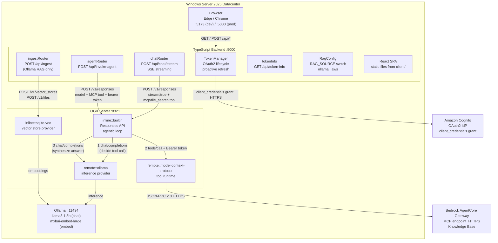
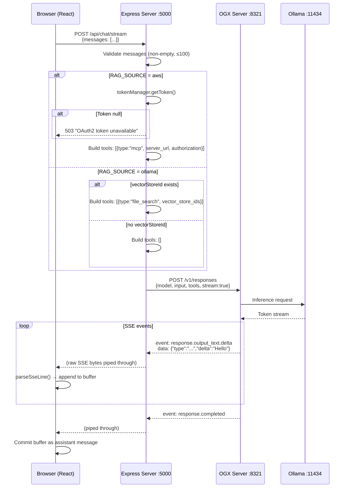
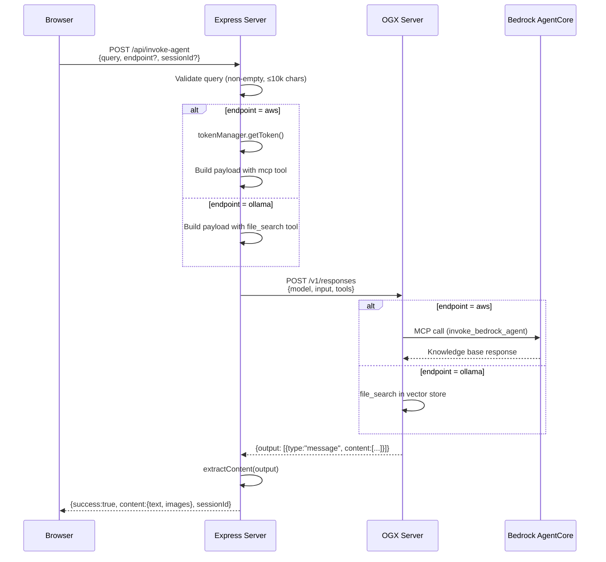
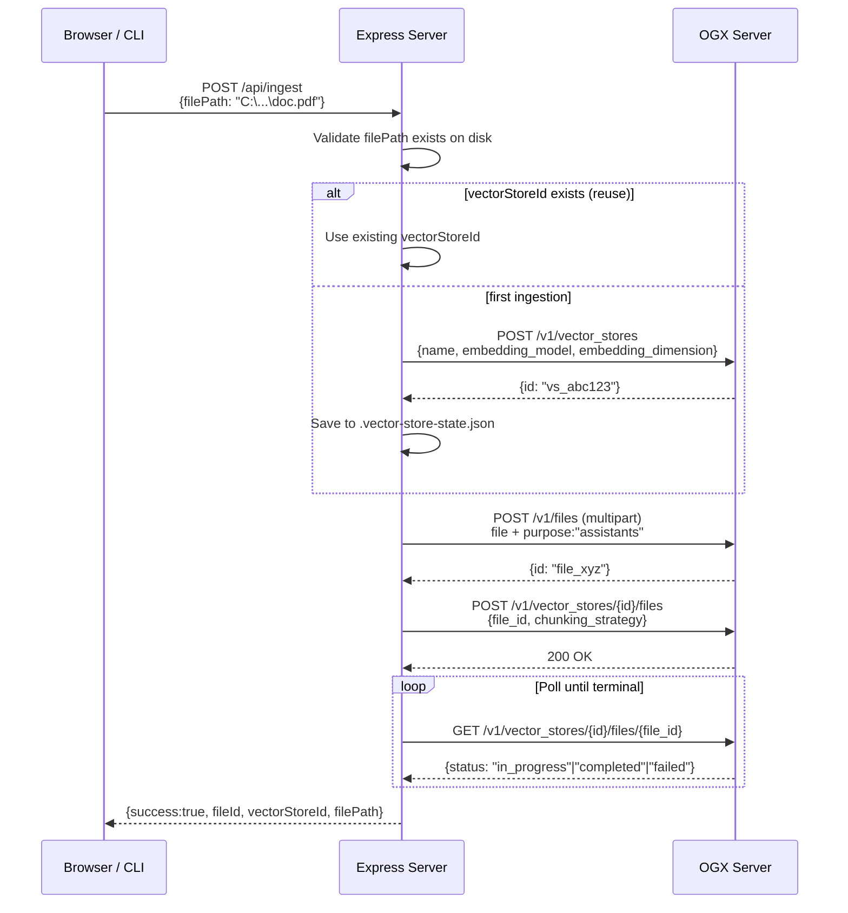
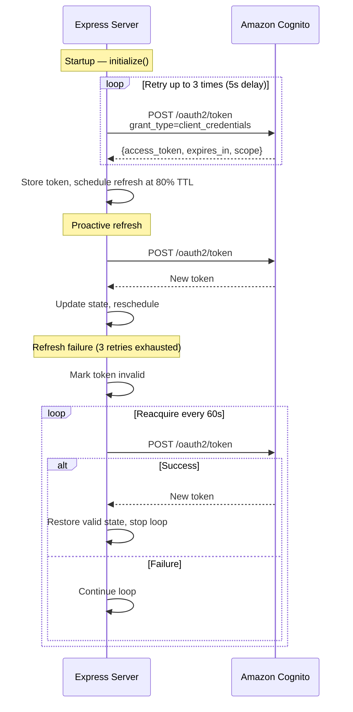

# Bedrock AgentCore Web App — Architecture Design

## Overview

A full-stack web application providing a chat interface to LLMs with RAG (Retrieval-Augmented Generation) support. The system supports two RAG backends:

- **AWS mode** — queries an AWS Bedrock AgentCore knowledge base via MCP tool
- **Ollama mode** — queries a local OGX vector store via `file_search` tool

The backend is an Express server that proxies requests to OGX (an OpenAI-compatible API gateway), and the frontend is a React SPA that renders streamed responses in real time.

---

## Architecture Topology



---

## Component Responsibilities

| Component | Technology | Responsibility |
|-----------|-----------|----------------|
| **client/** | React 18, Vite 5, TypeScript | Renders chat UI, manages streaming state, parses SSE events |
| **server/** | Express 4, TypeScript, tsx | API proxy layer, request validation, token management, RAG routing |
| **OGX** | Python (ogx stack) | OpenAI-compatible API gateway with Responses API, vector stores, and file storage |
| **Ollama** | Go binary | Local LLM inference (chat + embeddings) |
| **Cognito** | AWS managed | Issues OAuth2 access tokens via client_credentials grant |
| **Bedrock AgentCore** | AWS managed | MCP server providing knowledge base queries over a gateway |

---

## RAG Mode Comparison

| Aspect | `RAG_SOURCE=aws` | `RAG_SOURCE=ollama` |
|--------|-------------------|---------------------|
| Tool type | `mcp` | `file_search` |
| Knowledge source | AWS Bedrock Knowledge Base | Local OGX vector store (sqlite-vec) |
| Authentication | Bearer token from Cognito | None (local) |
| Document ingestion | AWS console / SDK | POST /api/ingest |
| Vector store persistence | Managed by AWS | `.vector-store-state.json` (local file) |
| Embedding model | Managed by AWS | `mxbai-embed-large` via Ollama |

---

## Sequence Diagrams

### 1. Streaming Chat (RAG-augmented)



### 2. Agent Invocation (non-streaming)



### 3. Document Ingestion (Ollama RAG only)



### 4. Token Lifecycle (OAuth2 client_credentials)



---

## Server Startup Sequence

1. Load environment variables from `webapp/.env`
2. Validate required config (gateway URL, Cognito credentials)
3. Create RAG config from `RAG_SOURCE`
4. If Ollama mode: load persisted vector store state → validate via GET `/v1/vector_stores/{id}` → restore or delete stale state
5. Acquire initial OAuth2 token from Cognito (3 retries)
6. Wire Express routes
7. Serve React SPA from `server/public/`
8. Listen on configured port (default 5000)

---

## Directory Structure

```
webapp/
├── .env                          # Shared environment config
├── package.json                  # Workspace root (concurrently)
├── client/                       # React frontend
│   ├── vite.config.ts            # Vite + Vitest config
│   ├── src/
│   │   ├── App.tsx               # Root component
│   │   ├── components/
│   │   │   ├── ChatApp.tsx       # Chat UI container
│   │   │   ├── MessageList.tsx   # Scrollable message list
│   │   │   ├── InputArea.tsx     # Text input + Send/Stop buttons
│   │   │   └── ClearButton.tsx   # Clear conversation button
│   │   ├── hooks/
│   │   │   └── useStreamingChat.ts  # Streaming state machine
│   │   ├── utils/
│   │   │   └── sseParser.ts      # SSE line parser (dual format)
│   │   └── types.ts              # Client-side type definitions
│   └── index.html
├── server/                       # Express backend
│   ├── src/
│   │   ├── index.ts              # Entry point, route wiring
│   │   ├── config.ts             # .env loading + validation
│   │   ├── chatRouter.ts         # POST /api/chat/stream
│   │   ├── agentRouter.ts        # POST /api/invoke-agent
│   │   ├── ingestRouter.ts       # POST /api/ingest
│   │   ├── tokenManager.ts       # OAuth2 token lifecycle
│   │   ├── tokenInfo.ts          # GET /api/token-info
│   │   ├── ragConfig.ts          # RAG source config factory
│   │   ├── ogxClient.ts          # OGX HTTP client
│   │   ├── vectorStoreState.ts   # Persistent vector store ID
│   │   └── types.ts              # Server-side type definitions
│   └── public/                   # Built React SPA (output of vite build)
└── docs/
    └── architecture.md           # This document
```

---

## Key Design Decisions

1. **OGX as unified API gateway** — All LLM and vector store interactions go through OGX's OpenAI-compatible Responses API. The backend never calls Ollama or AWS directly for inference.

2. **Raw SSE byte piping** — The chat stream endpoint pipes bytes from OGX directly to the browser without buffering or re-serializing. This minimizes latency and memory usage.

3. **Dependency injection** — Router factories accept `config`, `tokenManager`, `ragConfig`, and optional `fetchFn` for testability. No module-level singletons.

4. **Dual RAG source via config** — A single `RAG_SOURCE` env var switches the entire application between AWS and Ollama RAG modes. The same frontend and API surface serves both.

5. **Non-enumerable secrets** — `cognitoClientSecret` is defined as non-enumerable on the config object so `JSON.stringify()` never leaks it.

6. **Atomic state persistence** — Vector store state is written atomically (write-to-temp + rename) to prevent corruption on crash. All persistence errors are non-fatal.

7. **Proactive token refresh** — The TokenManager refreshes at 80% of TTL to avoid serving requests with expired tokens. Failed refreshes degrade gracefully (token marked invalid → 503 for AWS requests).
