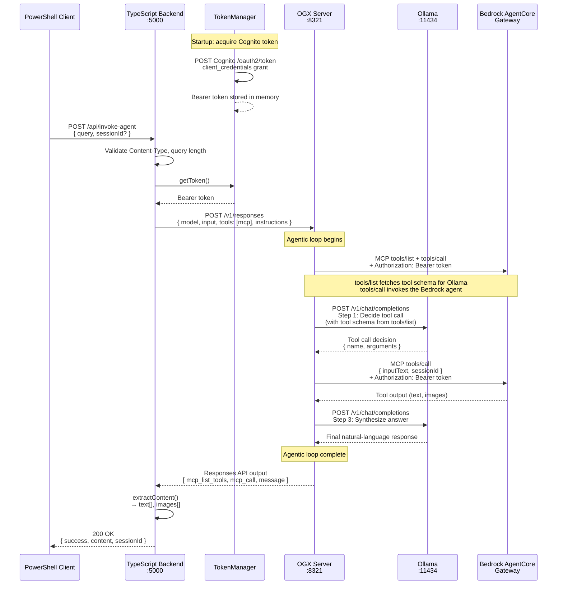

# Backend Request Sequence

Sequence diagram showing the full request flow when a user sends a query through the backend to the Bedrock AgentCore Gateway.

```mermaid
sequenceDiagram
    participant PS as PowerShell Client
    participant TS as TypeScript Backend<br/>:5000
    participant TM as TokenManager
    participant OGX as OGX Server<br/>:8321
    participant Ollama as Ollama<br/>:11434
    participant GW as Bedrock AgentCore<br/>Gateway

    Note over TM: Startup: acquire Cognito token
    TM->>TM: POST Cognito /oauth2/token<br/>client_credentials grant
    TM-->>TM: Bearer token stored in memory

    PS->>TS: POST /api/invoke-agent<br/>{ query, sessionId? }

    TS->>TS: Validate Content-Type, query length
    TS->>TM: getToken()
    TM-->>TS: Bearer token

    TS->>OGX: POST /v1/responses<br/>{ model, input, tools: [mcp], instructions }

    Note over OGX: Agentic loop begins

    OGX->>GW: MCP tools/list + tools/call<br/>+ Authorization: Bearer token
    Note over OGX,GW: tools/list fetches tool schema for Ollama<br/>tools/call invokes the Bedrock agent

    OGX->>Ollama: POST /v1/chat/completions<br/>Step 1: Decide tool call<br/>(with tool schema from tools/list)
    Ollama-->>OGX: Tool call decision<br/>{ name, arguments }

    OGX->>GW: MCP tools/call<br/>{ inputText, sessionId }<br/>+ Authorization: Bearer token
    GW-->>OGX: Tool output (text, images)

    OGX->>Ollama: POST /v1/chat/completions<br/>Step 3: Synthesize answer
    Ollama-->>OGX: Final natural-language response

    Note over OGX: Agentic loop complete

    OGX-->>TS: Responses API output<br/>[ mcp_list_tools, mcp_call, message ]

    TS->>TS: extractContent()<br/>→ text[], images[]

    TS-->>PS: 200 OK<br/>{ success, content, sessionId }
```
